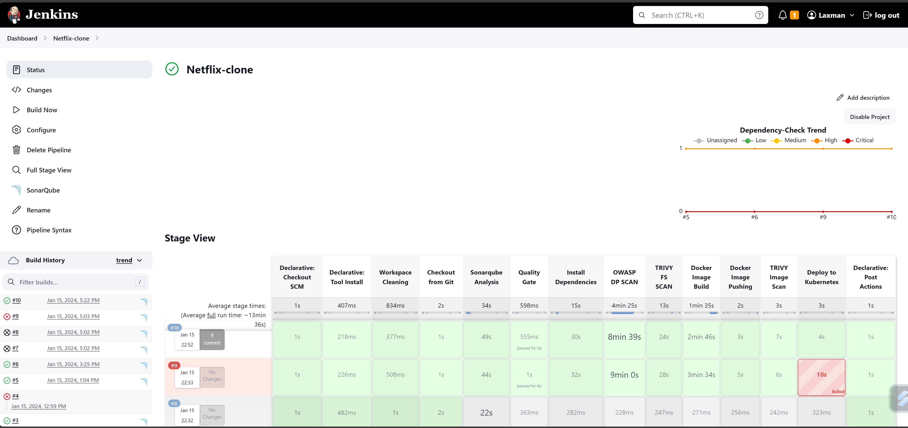
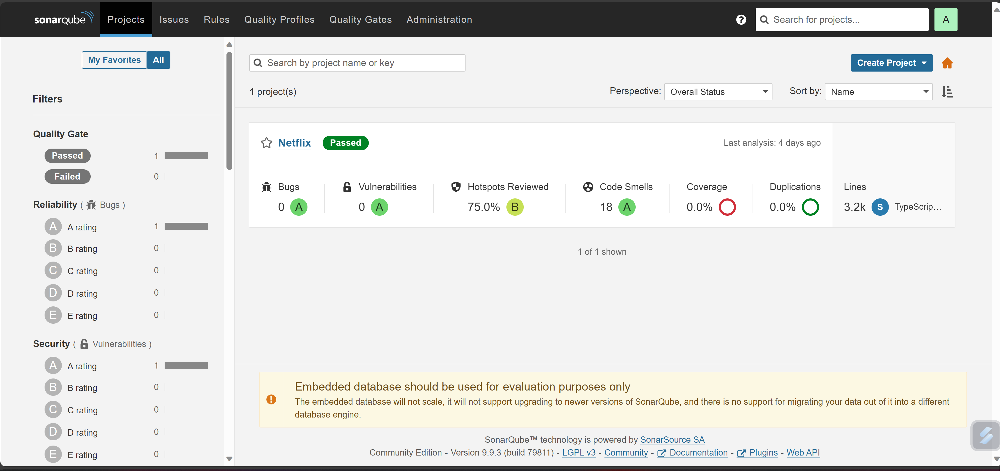
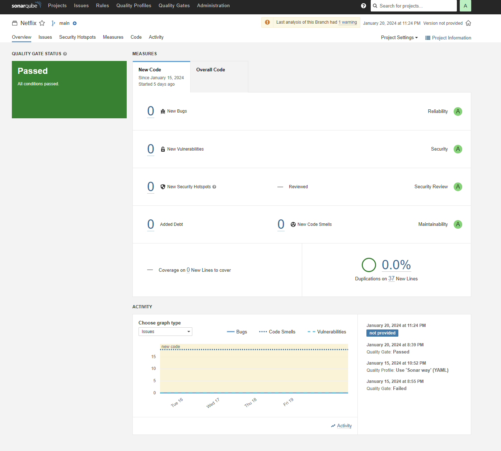
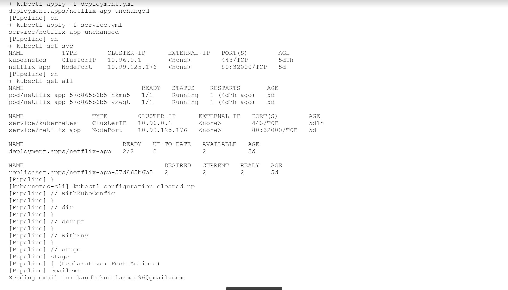

  

  <h3 align="center">Netflix Clone</h3>

  

  
  

  # For Guide

  [DevSecOps project — Netflix clone ](https://medium.com/@kandhukurilaxman96/devsecops-project-netflix-clone-878fcaa87480)

## Overview:

This project establishes a robust DevOps environment for seamless software development, integration, and deployment. Key components include Jenkins for continuous integration, SonarQube for code quality, Trivy and OWASP Dependency-Check for security scanning, and Prometheus with Grafana for monitoring.

## Prerequisites:

- A TMDB API key for accessing movie databases in your Netflix Clone application.
- DockerHub account for pushing and pulling Docker images.
- Gmail account for email notifications.
- Jenkins, Kubernetes, Docker, and necessary plugins installed.

## Project Highlights:

1. **Infrastructure Setup:**
   - Provisioned servers for Jenkins, Monitoring, and Kubernetes nodes.

2. **Toolchain Integration:**
   - Integrated Jenkins as the central orchestrator.
   - Incorporated tools like SonarQube, Trivy, Prometheus, Grafana, and OWASP Dependency-Check.

3. **CI/CD Pipelines:**
   - Automated workflows using Jenkins pipelines.
   - Included stages for code analysis, Docker image building, and Kubernetes deployment.

4. **Security Scanning:**
   - Implemented Trivy and OWASP Dependency-Check for vulnerability scanning.
   - Ensured continuous security checks in the DevOps pipeline.

5. **Monitoring and Visualization:**
   - Set up Prometheus for real-time metrics collection.
   - Integrated Grafana for comprehensive visualization.

6. **Email Notifications:**
   - Configured Jenkins for email alerts based on pipeline results.

## Project Files:

- **Jenkinsfile:** Customizable Jenkins pipeline for your specific workflows.
- **Kubernetes Manifest:** Modify for tailored application deployment on Kubernetes.
- **Dockerfile:** Customize for building Docker images according to project requirements.

## Server Requirements:

We need four servers for our today’s Project:

- **Jenkins Server:** Jenkins, SonarQube (Docker container), Trivy, kubectl.
- **Monitoring Server:** Prometheus, Node Exporter, Grafana.
- **Kubernetes Master Server:** Kubernetes Master Cluster Node for deploying applications on worker nodes.
- **Kubernetes Worker Server:** Kubernetes Worker Node for deploying applications.

  
  

  

  
  

  

  
  

  

  
  

  

  
  

  

  
  

  

  
  

  

  
  

